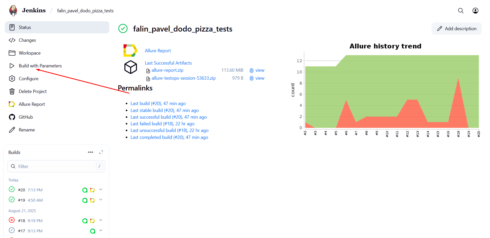
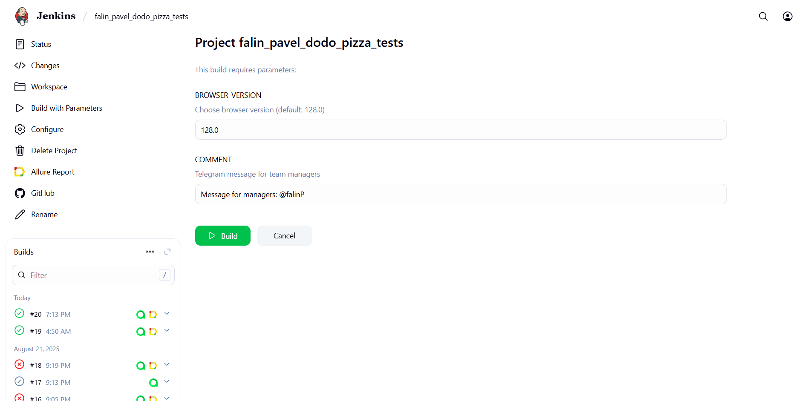
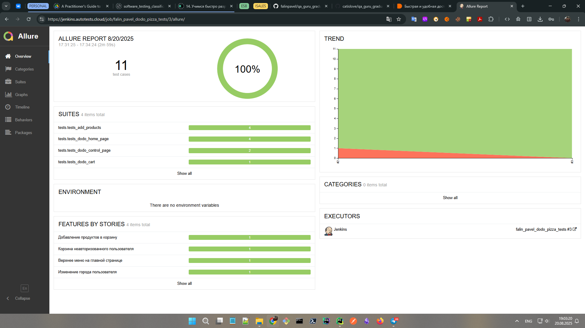
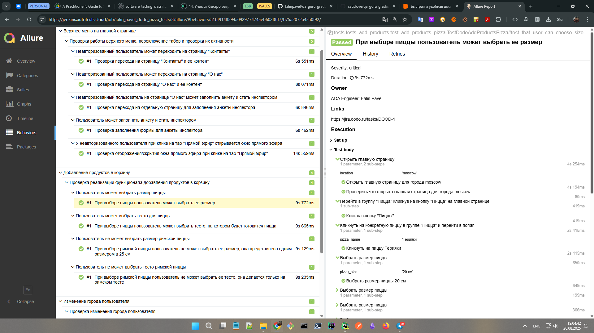
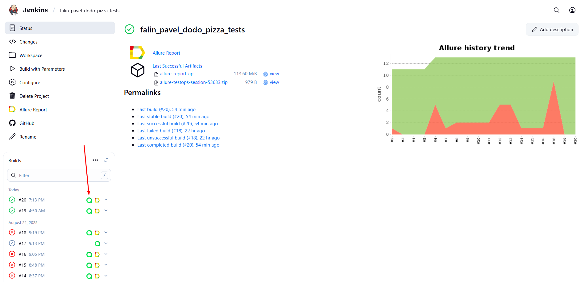
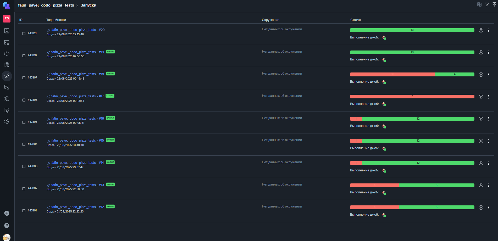
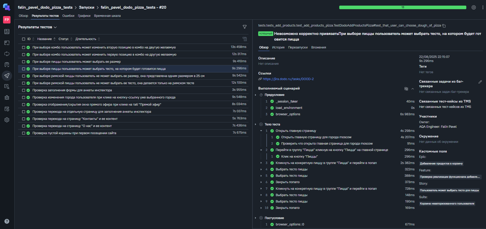
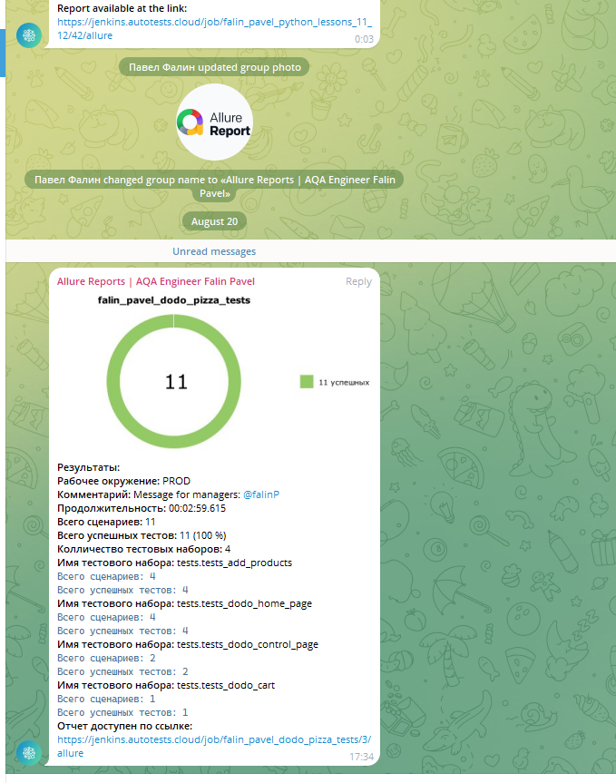

# 🎓 QA.GURU Graduation Project

Автоматизация тестирования веб-приложений "Додо Пицца" с помощью Python, Pytest и Selene 🚀

## О проекте

Этот проект является дипломной работой по курсу QA.GURU и представляет собой фреймворк для автоматизации тестирования веб-приложения "Додо Пицца" (https://dodopizza.ru/). В реализации использованы инструменты и библиотеки:

<p  align="center">
  <code></code>
  <code></code>
  <code></code>
  <code></code>
  <code></code>
  <code></code>
  <code></code>
  <code></code>
  <code></code>
</p>

##  Запуск тестов локально

1) Клонировать репозиторий: git clone https://github.com/falinpavel/qa_guru_graduation_project.git
2) Установить зависимости: pip install -r requirements.txt
3) Запуск тестов с генерацией отчетов Allure: pytest --alluredir=reports/allure-results
4) Просмотр отчета Allure (если установлен Allure CLI): allure serve reports/allure-results

##  Запуск тестов в Jenkins

1) Авторизоваться в Jenkins
2) Перейти в джобу falin_pavel_dodo_pizza_tests
3) Для запуска тестов в Jenkins нажать "Build with parameters"
4) Нажать "Build"

<p></p>
<p></p>

##  Визуализация результатов (Allure Reports и Allure TestOps)

## Если тесты запускались локально, то результаты можно посмотреть командой: 

```bash
allure serve reports/allure-results
```
## Если тесты запускались в Jenkins, то результаты можно посмотреть кликнув по иконке Allure Report в Jenkins в завершенной сборке

<p></p>
<p></p>
<p></p>

## Для просмотра результатов тестового прогона в Allure TestOps кликнув на соответствующую ему иконку в джобе Jenkins

<p></p>
<p></p>
<p></p>

##  Интеграция с Telegram в Jenkins для автоматической отправки результатов тестового прогона через бота

<p></p>
